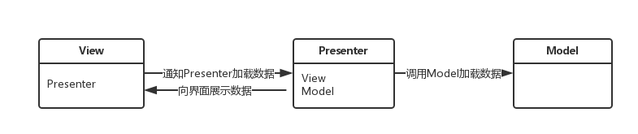
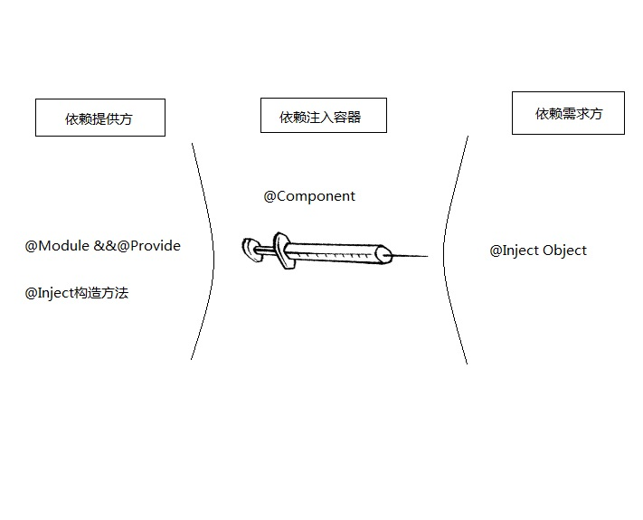
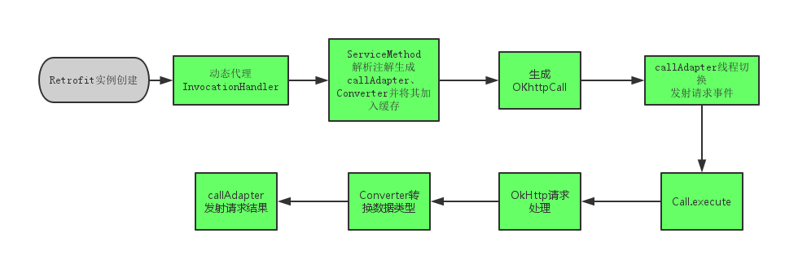

##1、MVP 
####1.1简介
M-Model-模型、V-View-视图、C-Controller-控制器，MVP作为MVC的演化版本，那么类似的MVP所对应的意义：M-Model-模型、V-View-视图、P-Presenter-表示器。 从MVC和MVP两者结合来看，Controlller/Presenter在MVC/MVP中都起着逻辑控制处理的角色，起着控制各业务流程的作用。而 MVP与MVC最不同的一点是M与V是不直接关联的也是就Model与View不存在直接关系，这两者之间间隔着的是Presenter层，其负责调控 View与Model之间的间接交互，MVP的结构图如下所示，对于这个图理解即可而不必限于其中的条条框框，毕竟在不同的场景下多少会有些出入的。在 Android中很重要的一点就是对UI的操作基本上需要异步进行也就是在MainThread中才能操作UI，所以对View与Model的切断分离是 合理的。此外Presenter与View、Model的交互使用接口定义交互操作可以进一步达到松耦合也可以通过接口更加方便地进行单元测试。

* 模型（Model）：负责处理数据的加载或者存储，比如从网络或本地数据库获取数据等；
* 视图（View）：负责界面数据的展示，与用户进行交互；
* 主持人（Presenter）：相当于协调者，是模型与视图之间的桥梁，将模型与视图分离开来。

####1.2与MVC区别
在MVC里，View是可以直接访问Model的！从而，View里会包含Model信息，不可避免的还要包括一些业务逻辑。所以当你修改View的时候会牵扯到Model,而且很容易造成代码冗余，难扩展复用、以及单元测试，同时当你的后台线程引用着Activity导致Activity的资源无法被系统回收时会引起内存泄露和OOM。而MVP则很好的改善了MVC所存在的一些问题，分离了视图逻辑和业务逻辑，降低了耦合。 

####1.3利弊
利：

* 分离了视图逻辑和业务逻辑，降低了耦合
* Activity只处理生命周期的任务，代码变得更加简洁
* 视图逻辑和业务逻辑分别抽象到了View和Presenter的接口中去，提高代码的可阅读性
* Presenter被抽象成接口，可以有多种具体的实现，所以方便进行单元测试
* 把业务逻辑抽到Presenter中去，避免后台线程引用着Activity导致Activity的资源无法被系统回收从而引起内存泄露和OOM

弊：

* 小型app开发的时候比较冗余
* 类方法创建得比较多

##2、Dagger2
####2.1 简介
Dagger2的 上手是有门槛的，有门槛是因为它里边的概念多，用起来复杂，可是一旦你学会了Dagger2的使用，你一定会爱不释手的。与ButterKnife和AndroidAnnotations不同，Dagger2是由Google开发和维护（之前是Squreup），在 性能上可以说是做到的极致（Dagger2在编译期间进行了依赖注入，完全去除了反射机制），Dagger2要解决的问题也和ButterKnife以及AndroidAnnotations不同，后者主要是解决控件的初始化，线程的切换等等，而Dagger2则类似于Java中的Spring框架，主要是为了解决应用程序在运行时的耦合问题，使用Dagger2可以帮助我们实现低耦合高聚合。

如果我们将Dagger2和1比较，他们两个在很多方面都非常相似，但也有很重要的区别，如下：

* 再也没有使用反射：图的验证、配置和预先设置都在编译的时候执行。
* 容易调试和可跟踪：完全具体地调用提供和创建的堆栈
* 更好的性能：谷歌声称他们提高了13%的处理性能
* 代码混淆：使用派遣方法，就如同自己写的代码一样
当然所有这些很棒的特点都需要付出一个代价，那就是缺乏灵活性，例如：Dagger2没用反射所以没有动态机制。

####2.2 六大注解

* @Inject: 通常在需要依赖的地方使用这个注解。换句话说，你用它告诉Dagger这个类或者字段需要依赖注入。这样，Dagger就会构造一个这个类的实例并满足他们的依赖。添加依赖注入对象，如果是直接在对象所在类里面注入，则前缀一定要大写，否则会报错
* @Module: Modules类里面的方法专门提供依赖，所以我们定义一个类，用@Module注解，这样Dagger在构造类的实例的时候，就知道从哪里去找到需要的 依赖。modules的一个重要特征是它们设计为分区并组合在一起（比如说，在我们的   app中可以有多个组成在一起的modules）。
* @Provide: 在modules中，我们定义的方法是用这个注解，以此来告诉Dagger我们想要构造对象并提供这些依赖。
* @Component: Components从根本上来说就是一个注入器，也可以说是@Inject和@Module的桥梁，它的主要作用就是连接这两个部分。 Components可以提供所有定义了的类型的实例，比如：我们必须用@Component注解一个接口然后列出所有的@Modules组成该组件，如 果缺失了任何一块都会在编译的时候报错。所有的组件都可以通过它的modules知道依赖的范围。
* @SubComponent:该注解从名字上就能知道，它是子Component，会完全继承父Component的所有依赖注入对象
* @Scope: Scopes可是非常的有用，Dagger2可以通过自定义注解限定注解作用域。没必要让每个对象都去了解如何管理他们的实例。在scope的例子中，我们用自定义Demo中的`@SecondScope`注解类，只要标注了该注解的方法对象 以达到创建的类实例就与`SecondActivity`“共生死“ 同时Scopes作用域又是单列模式  和`@Singleton`一样，区别是`@Singleton`的作用域是全局 而自定义的Scope是可以跟随其activity的生命周期 即同生共死

* @Qualifier: 当类的类型不足以鉴别一个依赖的时候,我们就可以使用这个注解标示。例如：在Android中，我们会需要不同类型的context所以我们就可以定义 qualifier注解“@ForApplication”和“@ForActivity”,这样当注入一个context的时候，我们就可以告诉 Dagger我们想要哪种类型的context。`@Named`是Dagger2对于@Qualifier一个默认实现,我们也可以自定义

##3 Retrofit2
####3.1 简介
Retrofit请求框架实现了高度的解耦，通过解析注解的得到的代理类生成http请求，然后将请求交给OkHttp。通过在Retrofit创建时生成的Converter再将OkHttp返回的数据进行类型转换得到自己需要的数据。

定义网络请求接口

`@GET("/repos/{owner}/{repo}/contributors")
    void contributors(@Path("owner") String owner, @Path("repo") String repo, Callback<List<Contributions>> callback);`
    
注解Get表示使用的Get请求方式，{owner}代表要被替换的数据
Converter默认是Gson解析，可以自定义

####3.2 常用注解
* @Path：所有在网址中的参数（URL的问号前面），如：
     https://api.github.com/repos/{owner}/{repo}/contributors
* @Query：URL问号后面的参数，如：
     https://api.github.com/repos/square/retrofit/contributors?access_token={access_token}
* @QueryMap：相当于多个@Query
* @Field：用于POST请求，提交单个数据
* @Body：相当于多个@Field，以对象的形式提交    

##4 Demo
####4.1 简介

* 从图中 @MainComponent用于构建接口，该接口把所有封装在一起。这里，我们定义需要依赖的模块(或组件)即@MainModule。这里定义了那些图依赖应当公开可见(可注入)，我们的组件可以注入哪里。@MainComponent是连接@MainModule和@Inject的桥梁。
* @MainModule提供对象的实例化   以 @Provides 标明方法提供依赖对象   
* MainAppAplication 作为app程序的入口，起到一个提供基础类的作用，它的MainAppComponent被依赖（dependencies）于MainComponent,MainActivity可以注入MainAppComponent所依赖的对象，但是MainAppComponent需要对其MainAppModule中以 @Provides 标明方法提供依赖对象进行定义 即User getUser()以让MainActivity获取其注入的对象
* SecondComponent是其子Component(SubComponent)可以完全继承MainAppComponent的所有依赖对象。

**SubComponent与dependencies 区别**

Subcomponent其功能效果优点类似component的dependencies。都相当于相当于子父类继承关系，但是使用@Subcomponent不需要在父component中显式添加子component需要用到的对象，只需要添加返回子Component的方法即可，子Component能自动在父Component中查找缺失的依赖。

