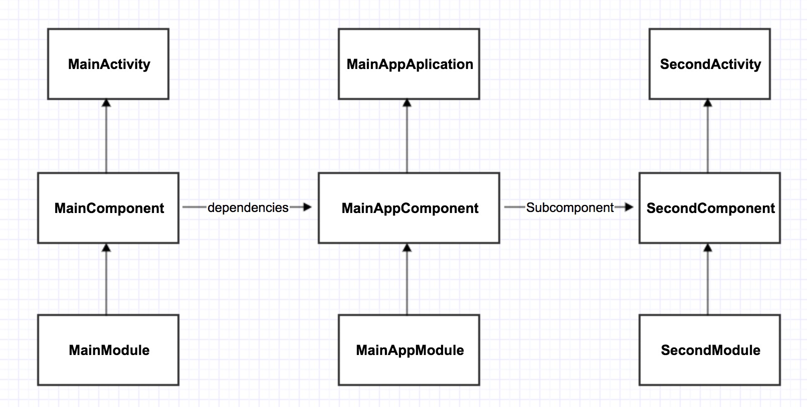

##Dagger2 简介
Dagger2是Dagger1的分支，由谷歌公司接手开发，目前的版本是2.0。Dagger2是受到AutoValue项目的启发。 刚开始，Dagger2解决问题的基本思想是：利用生成和写的代码混合达到看似所有的产生和提供依赖的代码都是手写的样子。
如果我们将Dagger2和1比较，他们两个在很多方面都非常相似，但也有很重要的区别，如下：

* 再也没有使用反射：图的验证、配置和预先设置都在编译的时候执行。
* 容易调试和可跟踪：完全具体地调用提供和创建的堆栈
* 更好的性能：谷歌声称他们提高了13%的处理性能
* 代码混淆：使用派遣方法，就如同自己写的代码一样
当然所有这些很棒的特点都需要付出一个代价，那就是缺乏灵活性，例如：Dagger2没用反射所以没有动态机制。

##Dagger2 六大注解
* @Inject: 通常在需要依赖的地方使用这个注解。换句话说，你用它告诉Dagger这个类或者字段需要依赖注入。这样，Dagger就会构造一个这个类的实例并满足他们的依赖。
* @Module: Modules类里面的方法专门提供依赖，所以我们定义一个类，用@Module注解，这样Dagger在构造类的实例的时候，就知道从哪里去找到需要的 依赖。modules的一个重要特征是它们设计为分区并组合在一起（比如说，在我们的   app中可以有多个组成在一起的modules）。
* @Provide: 在modules中，我们定义的方法是用这个注解，以此来告诉Dagger我们想要构造对象并提供这些依赖。
* @Component: Components从根本上来说就是一个注入器，也可以说是@Inject和@Module的桥梁，它的主要作用就是连接这两个部分。 Components可以提供所有定义了的类型的实例，比如：我们必须用@Component注解一个接口然后列出所有的@Modules组成该组件，如 果缺失了任何一块都会在编译的时候报错。所有的组件都可以通过它的modules知道依赖的范围。
* @Scope: Scopes可是非常的有用，Dagger2可以通过自定义注解限定注解作用域。后面会演示一个例子，这是一个非常强大的特点，因为就如前面说的一样，没 必要让每个对象都去了解如何管理他们的实例。在scope的例子中，我们用自定义Demo中的`@SecondScope`注解类，只要标注了该注解的方法对象 都只能被SecondActivity所调用，而MainActivity则不能调用。同时Scopes作用域又是单列模式  和`@Singleton`一样，区别是`@Singleton`的作用域是全局 而自定义的Scope是可以限制区域 不让外部类调用。
* @Qualifier: 当类的类型不足以鉴别一个依赖的时候，我们就可以使用这个注解标示。例如：在Android中，我们会需要不同类型的context，所以我们就可以定义 qualifier注解“@ForApplication”和“@ForActivity”，这样当注入一个context的时候，我们就可以告诉 Dagger我们想要哪种类型的context。`@Named`是Dagger2对于@Qualifier一个默认实现，我们也可以自定义

##Dagger2 Demo结构

* `@Component`用于构建接口，该接口把所有封装在一起。这里，我们定义需要依赖的模块(或组件)。这里定义了那些图依赖应当公开可见(可注入)，我们的组件可以注入哪里。@Component是连接@Module和@Inject的桥梁。
* `@moudule`提供对象的实例化   以 @Provides 标明方法提供依赖对象

